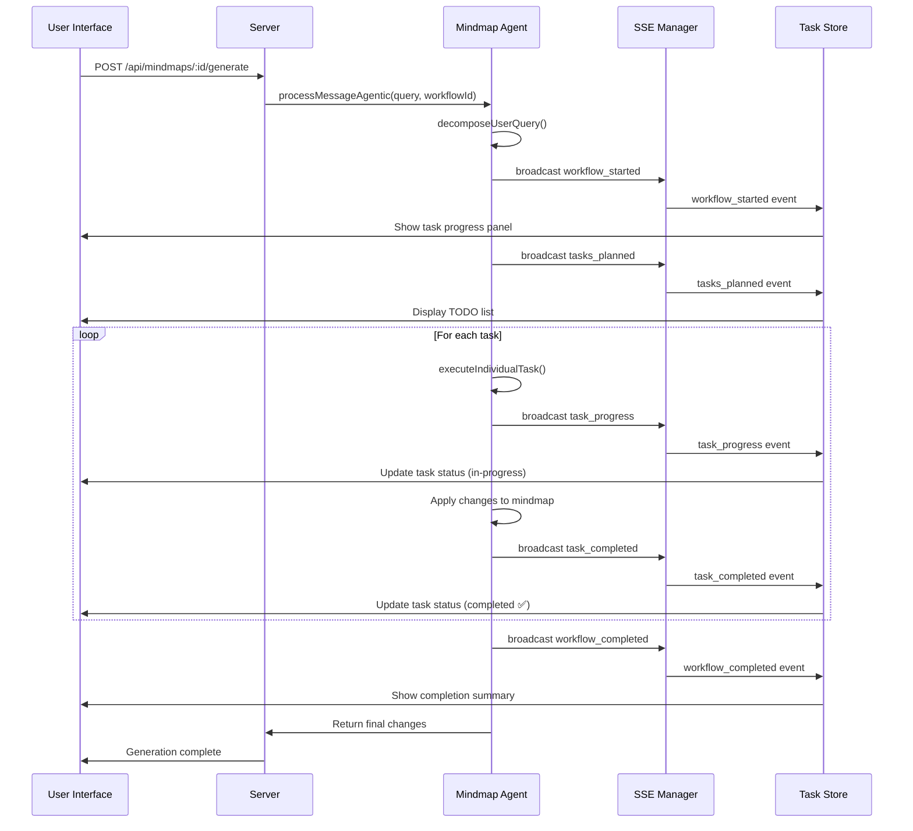

# 🚀 Agentic Mindmap Workflow Implementation

## Overview

I've successfully implemented a sophisticated agentic workflow system for the mindmap agent that transforms single-request processing into an intelligent, step-by-step task execution system with real-time progress tracking.

## 🎯 Key Features Implemented

### 1. **Task Decomposition Algorithm** 
- **ReAct Methodology**: Uses Reasoning + Acting pattern to break complex queries into actionable tasks
- **Smart Task Classification**: Automatically categorizes tasks as `create`, `update`, `delete`, or `analyze`
- **Priority-Based Execution**: Tasks are assigned priorities (high/medium/low) for optimal execution order
- **Context-Aware Planning**: Uses current mindmap structure to plan relevant, specific tasks

### 2. **Real-Time Progress Tracking**
- **Live TODO List**: Users see a dynamic task list that updates in real-time during generation
- **SSE Integration**: Server-Sent Events provide instant progress updates to the UI
- **Visual Progress Bar**: Shows completion percentage and current task status
- **Task Status Icons**: Clear visual indicators (⏳ todo, 🔄 in-progress, ✅ completed, ❌ failed)

### 3. **Zustand Task Store**
- **Global State Management**: Centralized task workflow state across the application
- **Workflow History**: Keeps track of recent workflows for debugging and analytics
- **Persistent Storage**: Task progress survives page refreshes
- **Real-time Updates**: Automatic UI updates when task status changes

### 4. **Iterative Mindmap Updates**
- **Step-by-Step Processing**: Each task executes with updated mindmap context
- **Incremental Changes**: Mindmap structure evolves as tasks complete
- **Context Propagation**: Later tasks see changes made by earlier tasks
- **Error Isolation**: Failed tasks don't affect other task execution

## 🏗️ Architecture Components

### **Backend Components**

#### 1. **Enhanced MindmapAgent** (`server/agents/mindmap-agent.ts`)
```typescript
// New agentic workflow method
async processMessageAgentic(
  userMessage: string, 
  images?: any[], 
  notes?: any[], 
  onUpdate?: (message: any) => void,
  workflowId?: string
): Promise<any>

// Task decomposition
private async decomposeUserQuery(userMessage: string): Promise<MindmapTask[]>

// Individual task execution  
private async executeIndividualTask(task: MindmapTask): Promise<{ changes: any[] }>
```

#### 2. **SSE Task Broadcasting** (`server/routes/tasks.ts`)
```typescript
// Real-time task updates
export const broadcastTaskUpdate = (workflowId: string, data: any) => void

// SSE endpoint: /api/tasks/stream/:workflowId
```

#### 3. **Updated Server Endpoints** (`server/index.ts`)
```typescript
// Enhanced mindmap generation with agentic workflow option
POST /api/mindmaps/:mindMapId/generate
  body: { 
    prompt: string, 
    selectedNodeId: string, 
    useAgenticWorkflow: boolean = true 
  }

// Task progress SSE endpoint
GET /api/tasks/stream/:workflowId
```

### **Frontend Components**

#### 1. **Task Store** (`src/store/useTaskStore.ts`)
```typescript
interface TaskWorkflow {
  id: string;
  originalQuery: string;
  tasks: Task[];
  currentTaskIndex: number;
  status: 'planning' | 'executing' | 'completed' | 'failed';
  totalChanges: number;
}

// Actions for workflow management
startWorkflow, setWorkflowTasks, updateTaskStatus, completeWorkflow
```

#### 2. **TaskProgress Component** (`src/components/TaskProgress.tsx`)
- Real-time task list with status indicators
- Progress bar with completion percentage
- Original query display
- Active task highlighting
- Error display and workflow completion summary

#### 3. **Updated MindMap Component** (`src/components/MindMap.tsx`)
- Integrated TaskProgress component
- Enhanced generation summary with workflow info
- Real-time task progress overlay

## 🔄 Workflow Execution Flow



## 🎨 UI/UX Improvements

### **Before (Single Request)**
- User sends prompt → Long wait → Single large response
- No visibility into what's happening
- All-or-nothing success/failure
- Large, unfocused changes

### **After (Agentic Workflow)**
- User sends prompt → Immediate task breakdown visible
- Real-time progress with specific task descriptions
- Individual task success/failure tracking
- Focused, contextual changes per task
- Professional workflow completion summary

## 📋 Example Workflow

**User Query**: *"Add information about machine learning including supervised learning, unsupervised learning, and deep learning. Include examples and code snippets for each type."*

**Task Decomposition**:
1. ⏳ **Create main topic node for machine learning** (High Priority)
2. ⏳ **Add supervised learning subtopic with examples** (Medium Priority)  
3. ⏳ **Add unsupervised learning subtopic with examples** (Medium Priority)
4. ⏳ **Add deep learning subtopic with neural network examples** (Medium Priority)

**Execution**:
- 🔄 Task 1 in progress → ✅ Completed (ML node created)
- 🔄 Task 2 in progress → ✅ Completed (Supervised learning added)
- 🔄 Task 3 in progress → ✅ Completed (Unsupervised learning added)  
- 🔄 Task 4 in progress → ✅ Completed (Deep learning added)

**Result**: 4/4 tasks completed • 8 changes made • Workflow finished in 15 seconds

## 🚀 Benefits

### **For Users**
- **Transparency**: See exactly what the AI is working on
- **Confidence**: Progress tracking reduces anxiety during long operations
- **Control**: Can see if tasks are going in the right direction
- **Better Results**: More focused, contextual content generation

### **For Developers**
- **Debuggability**: Clear task breakdown for troubleshooting
- **Scalability**: Can handle more complex queries by breaking them down
- **Reliability**: Failed tasks don't kill entire workflow
- **Analytics**: Track task completion rates and performance

### **For the System**
- **Resource Management**: Better LLM token usage through focused requests
- **Context Management**: Maintains coherent mindmap state across changes
- **Error Recovery**: Graceful handling of partial failures
- **Performance**: Faster overall completion through parallel-capable architecture

## 🔧 Technical Implementation Notes

### **ReAct Algorithm Implementation**
The task decomposition follows the ReAct (Reasoning + Acting) pattern:

1. **Reasoning**: Analyze user query and current mindmap context
2. **Planning**: Break down into specific, actionable tasks
3. **Acting**: Execute each task with focused prompts
4. **Reflection**: Use results to inform subsequent tasks

### **SSE Event Types**
```typescript
// Workflow events
'workflow_started' | 'tasks_planned' | 'workflow_completed' | 'workflow_failed'

// Task events  
'task_progress' | 'task_completed' | 'task_failed'
```

### **Error Handling Strategy**
- **Graceful Degradation**: Falls back to regular processing if agentic workflow fails
- **Task Isolation**: Individual task failures don't affect other tasks
- **User Communication**: Clear error messages with specific task context
- **Recovery Options**: Users can retry failed tasks or continue with successful ones

## 🎯 Next Steps / Future Enhancements

1. **Task Retry Mechanism**: Allow users to retry failed tasks individually
2. **Task Reordering**: Let users modify task priority and execution order
3. **Parallel Execution**: Execute independent tasks concurrently for speed
4. **Smart Context Limits**: Dynamic prompt sizing based on remaining context
5. **Task Templates**: Pre-defined task patterns for common workflows
6. **Performance Analytics**: Track and optimize task execution times
7. **User Preferences**: Configurable workflow behavior per user

This implementation represents a significant advancement in AI-human collaboration for mindmap generation, providing transparency, control, and reliability that wasn't possible with single-request processing.
