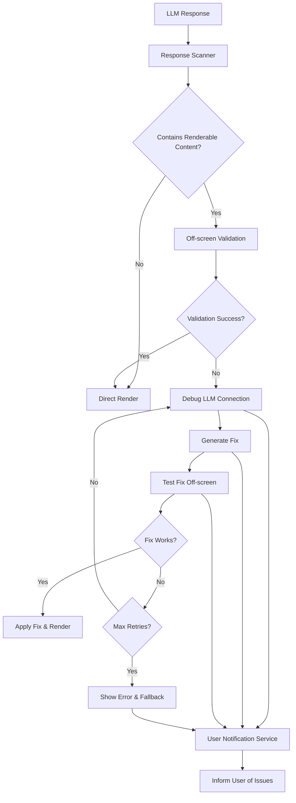

# Response Validation and Error Correction System

This system automatically scans LLM responses for renderable content (like Mermaid diagrams, LaTeX expressions, and code blocks), validates them off-screen, and automatically fixes any errors using a separate debugging LLM connection.

## Architecture



## Components

### 1. Response Scanner (`ResponseScanner`)

- Scans response content for renderable elements
- Identifies Mermaid diagrams, LaTeX expressions, code blocks
- Returns structured data about each renderable item

### 2. Off-Screen Validator (`OffScreenValidator`)

- Creates hidden DOM elements to test rendering
- Validates Mermaid diagrams using the actual mermaid library
- Validates LaTeX using KaTeX
- Performs basic syntax checks for code blocks
- Returns validation results with specific error messages

### 3. Debug LLM Service (`DebugLLMService`)

- Separate LLM connection specifically for fixing errors
- Generates targeted prompts for different content types
- Extracts fixed content from LLM responses
- Handles retry logic and timeout management

### 4. Validation Orchestrator (`ResponseValidationOrchestrator`)

- Main coordinator that ties all components together
- Manages the complete validation and correction workflow
- Provides progress updates to the UI
- Implements recursive retry logic with exponential backoff

### 5. User Notification System (`ValidationStatusNotification`)

- Real-time progress updates during validation
- User controls for enabling/disabling validation
- Error reporting and status display
- Auto-dismiss on completion

## Integration Points

### Chat Flow Integration

The system is integrated into the chat flow at the message processing level:

1. **Message Reception**: When an assistant message is received via SSE
2. **Pre-render Validation**: Before displaying, the message goes through validation
3. **Automatic Correction**: If errors are found, they're automatically fixed
4. **User Notification**: Users are informed of any correction attempts
5. **Fallback Handling**: If correction fails, original content is shown with error indicators

### Configuration

```typescript
// Enable/disable validation globally
ResponseValidationOrchestrator.setEnabled(true);

// Configure retry attempts and timeouts
ResponseValidationOrchestrator.configure({
  maxRetryAttempts: 3,
  timeoutMs: 30000,
  skipValidationForTypes: ['image'], // Optional content types to skip
});
```

### Progress Monitoring

```typescript
// Subscribe to validation progress
const unsubscribe = ResponseValidationOrchestrator.onProgress(progress => {
  console.log(`Validation stage: ${progress.stage}`);
  console.log(`Progress: ${progress.completedItems}/${progress.totalItems}`);
});
```

## Supported Content Types

### Mermaid Diagrams

- Full syntax validation using the mermaid library
- Error detection for invalid node names, missing connections, syntax errors
- Automatic correction of common issues like missing quotes, invalid characters

### LaTeX Expressions

- Both inline (`$...$`) and block (`$$...$$`) expressions
- Validation using KaTeX renderer
- Error correction for unmatched braces, invalid commands, syntax errors

### Code Blocks

- Basic syntax validation for various languages
- JSON parsing validation
- Language-specific error detection
- Syntax error correction

## API Endpoints

### `/api/debug-fix`

Server endpoint for LLM-based error correction:

```typescript
POST /api/debug-fix
{
  "request": {
    "originalContent": "broken mermaid code",
    "errorMessage": "syntax error details",
    "contentType": "mermaid",
    "language": "mermaid"
  },
  "retryCount": 0
}
```

Response:

```typescript
{
  "success": true,
  "fixedContent": "corrected content",
  "explanation": "What was fixed",
  "retryCount": 0
}
```

## User Experience

### Real-time Feedback

- Progress notifications appear in the bottom-right corner
- Shows current validation stage and progress
- Provides controls to enable/disable validation
- Auto-dismisses on successful completion

### Error Handling

- Graceful fallback to original content if correction fails
- Detailed error messages for debugging
- User can choose to disable validation if desired
- Retry attempts are clearly communicated

### Performance Considerations

- Off-screen validation runs in hidden DOM elements
- Parallel processing of multiple renderable items
- Configurable timeouts prevent hanging
- Cleanup of temporary DOM elements

## Configuration Storage

User preferences for validation are stored in localStorage:

- `responseValidationEnabled`: boolean flag for global enable/disable

## Testing

To test the system:

1. Send a message with broken Mermaid syntax
2. Observe the validation notification appear
3. Check console for validation logs
4. Verify the corrected content renders properly

Example broken Mermaid:

````
```mermaid
graph TD
  A --> B
  C -> D  // Wrong arrow syntax
````

The system should automatically correct this to use proper `-->` syntax.

## Future Enhancements

1. **Content Type Extensions**: Add support for more renderable content types
2. **Custom Validation Rules**: Allow users to define custom validation rules
3. **Performance Optimization**: Cache validation results for repeated content
4. **Analytics**: Track validation success rates and common error patterns
5. **User Training**: Suggest best practices based on common errors
