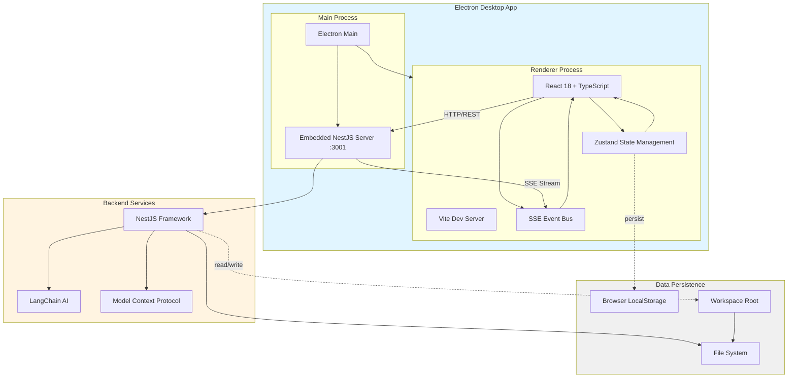
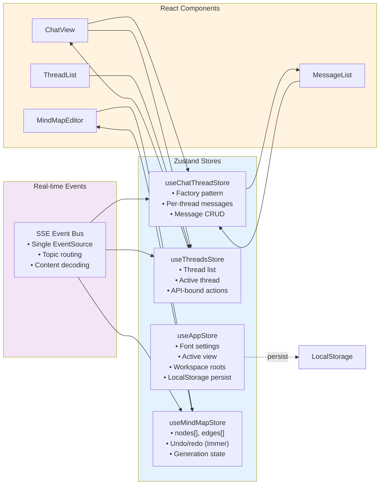
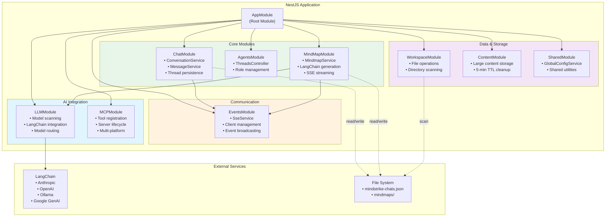
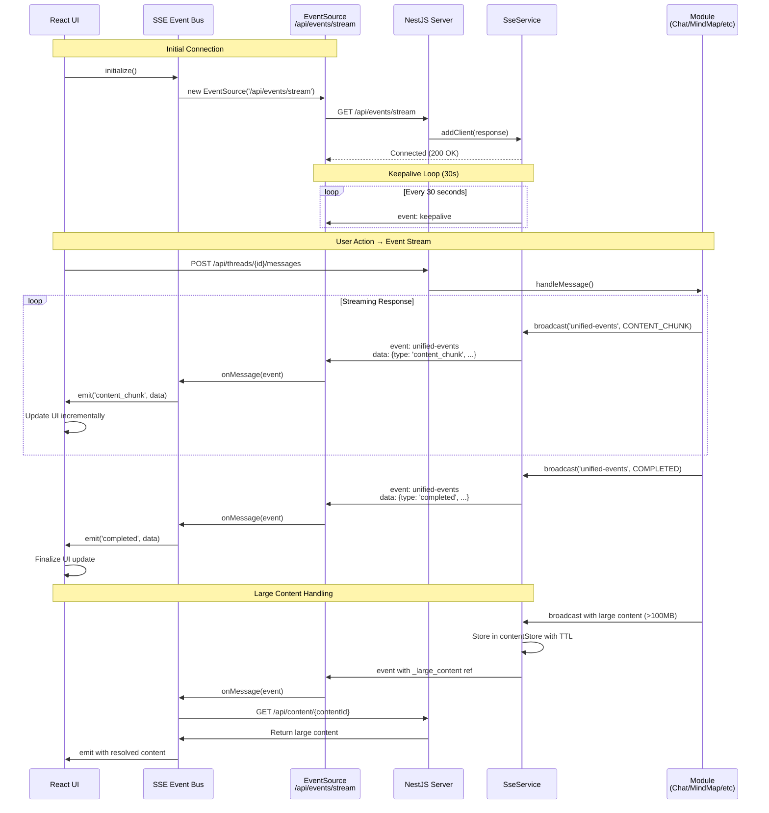
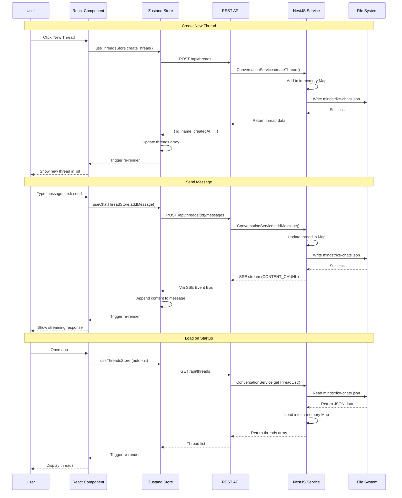
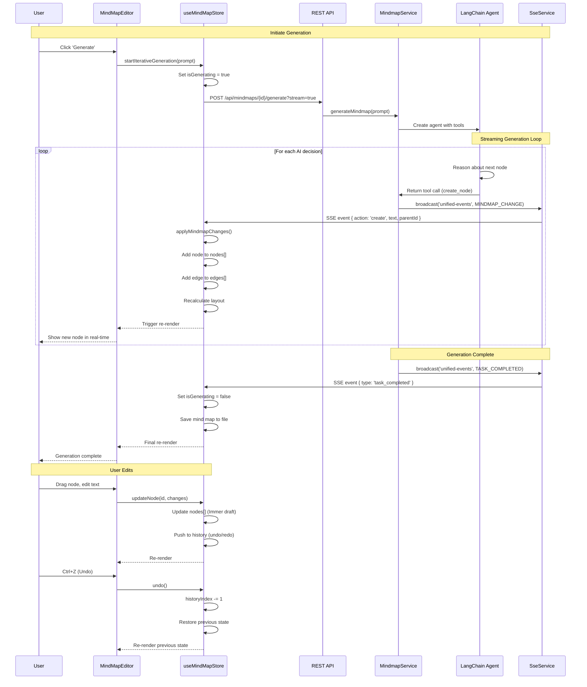
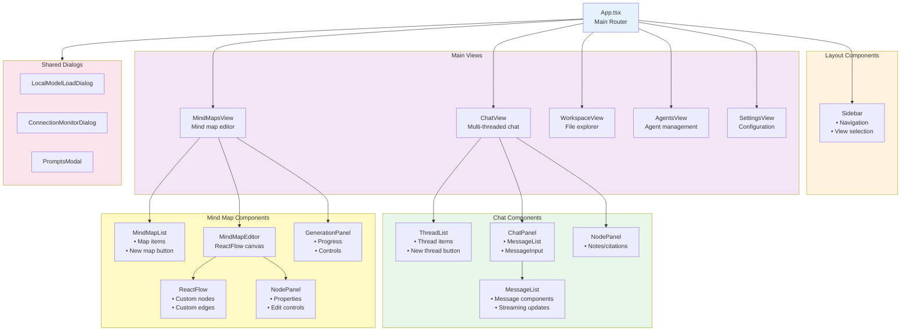

<!-- THIS FILE IS AUTO-GENERATED FROM spec/foundation.json -->
<!-- DO NOT EDIT THIS FILE DIRECTLY -->
<!-- Edit spec/foundation.json and run: fspec generate-foundation-md -->

# MindStrike Project Foundation

## Vision

Empower knowledge workers with an AI-powered assistant platform that seamlessly integrates conversational AI, visual knowledge mapping, and autonomous agent workflows to enhance productivity, creativity, and decision-making.

---

## Problem Space

### Information Overload and Cognitive Complexity in AI-Assisted Knowledge Work

Knowledge workers struggle to manage information overload and cognitive complexity when working with multiple AI conversations, research threads, and interconnected ideas simultaneously. Traditional AI chat interfaces are linear and isolated, making it difficult to track multiple conversation threads, visualize relationships between concepts, organize knowledge, and leverage AI agents for complex workflows.

**Impact:** high

---

## Solution Space

### Overview

MindStrike provides a unified workspace that combines multi-threaded conversational AI, interactive mind mapping for visual knowledge organization, and autonomous agent workflows. Users can manage multiple AI conversation threads simultaneously, visualize connections between ideas using mind maps, and leverage specialized AI agents for complex tasks, all within a single integrated desktop application.

### Capabilities

- **Multi-threaded Conversational AI**: Manage multiple independent AI conversation threads simultaneously, allowing users to explore different aspects of a problem or maintain separate context-specific discussions
- **Interactive Mind Mapping**: Create, edit, and visualize knowledge graphs using interactive mind maps with node-based interfaces, enabling users to organize concepts, relationships, and insights visually
- **Autonomous Agent Workflows**: Define and execute complex AI agent workflows that can perform multi-step tasks autonomously, leveraging specialized agents for different capabilities
- **Multi-Model AI Support**: Configure and switch between multiple LLM providers (local and cloud-based) including Anthropic, OpenAI, Google, Ollama, and custom models with flexible model management
- **Workspace Management**: Organize work into customizable workspaces with persistent state, allowing users to maintain different contexts for various projects or research areas
- **Code Editing and Integration**: Built-in Monaco code editor for working with code snippets, scripts, and technical content directly within the AI workflow

---

## Personas

### Knowledge Worker

Professionals who work with complex information, research, and analysis - including researchers, analysts, consultants, writers, and developers

**Goals:**
- Manage multiple AI conversations to explore different aspects of a problem
- Organize and visualize connections between ideas and research findings
- Increase productivity by leveraging AI for knowledge synthesis

### AI Power User

Technical users who want advanced control over AI models, parameters, and workflows - including ML engineers, prompt engineers, and AI researchers

**Goals:**
- Configure and fine-tune local and cloud-based LLM models
- Create and manage complex AI agent workflows
- Experiment with different AI models and compare results

---

## Architecture Diagrams

### Overall Architecture

### Frontend State Management

### Backend NestJS Modules

### Real-time Communication Flow (SSE)

### Data Persistence Flow

### Mind Map Generation Flow

### React Component Hierarchy

---
