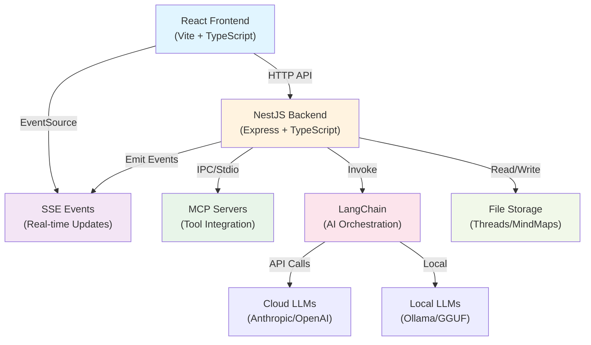
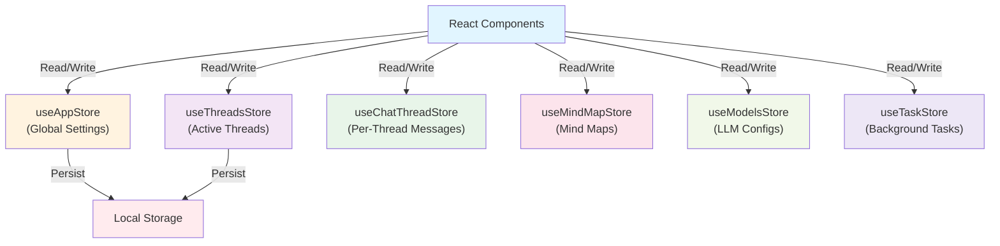
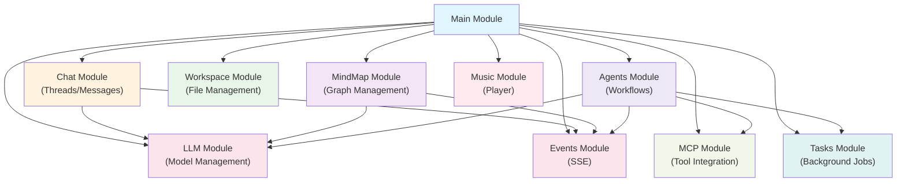
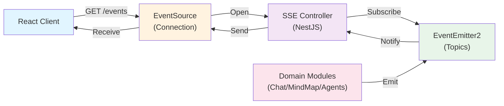
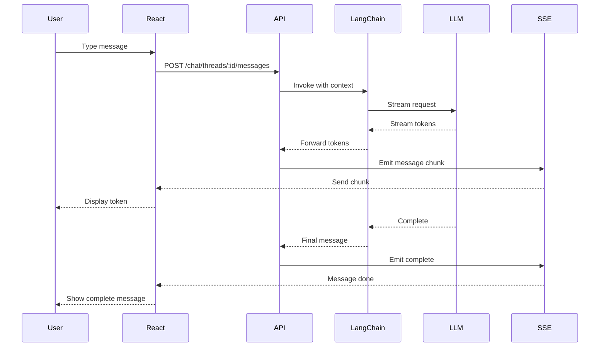

<!-- THIS FILE IS AUTO-GENERATED FROM spec/foundation.json -->
<!-- DO NOT EDIT THIS FILE DIRECTLY -->
<!-- Edit spec/foundation.json and run: fspec generate-foundation -->

# MindStrike Project Foundation Document

**IMPORTANT NOTE:** MindStrike uses strict TypeScript, ESLint enforcement, and comprehensive testing. All code must pass `npm run lint` before committing.

## 1. What We Are Building

### Project Overview

MindStrike is a comprehensive AI knowledge assistant platform that unifies multiple AI capabilities: multi-threaded conversational AI with custom system prompts, interactive mind mapping with AI-powered generation, workspace file management, background agent workflows with real-time progress tracking, local and cloud LLM support, extensible MCP tool integration, and an integrated music player. Available as both an Electron desktop application and standalone web app.

### Technical Requirements

#### Core Technologies

- **Frontend Framework:** React 18 - TypeScript-based React frontend with functional components and hooks
- **Backend Framework:** NestJS - Modular backend with Express, organized by domain modules
- **Build Tooling:** Vite - Fast build tool with HMR for frontend and backend
- **Desktop Platform:** Electron - Cross-platform desktop packaging (DMG, NSIS, AppImage)
- **Server Runtime:** Node.js - TypeScript-based server runtime with ES modules
- **AI Orchestration:** LangChain - LLM orchestration with support for multiple providers
- **Tool Integration:** Model Context Protocol (MCP) - Extensible tool integration protocol for external services

#### Key Libraries & Dependencies

**State Management:**
- **zustand**: Global state with persist middleware
- **immer**: Immutable state updates for undo/redo

**UI Components:**
- **reactflow**: Mind map visualization with custom nodes
- **monaco-editor**: Code editing with syntax highlighting
- **lucide-react**: Icon library
- **react-hot-toast**: Toast notifications

**Styling:**
- **tailwindcss**: Utility-first CSS framework
- **@tailwindcss/typography**: Rich text styling

**AI & LLM:**
- **langchain**: AI orchestration framework
- **@langchain/anthropic**: Claude integration
- **@langchain/openai**: OpenAI integration
- **@langchain/ollama**: Local LLM integration
- **@langchain/google-genai**: Google AI integration
- **node-llama-cpp**: Local GGUF model support

**Tool Integration:**
- **@modelcontextprotocol/sdk**: MCP client and server SDK
- **@modelcontextprotocol/server-filesystem**: File system MCP server
- **@modelcontextprotocol/server-github**: GitHub MCP server

**Backend:**
- **@nestjs/core**: NestJS framework core
- **@nestjs/platform-express**: Express integration
- **@nestjs/swagger**: OpenAPI documentation
- **@nestjs/event-emitter**: Event-driven architecture
- **class-validator**: DTO validation
- **class-transformer**: DTO transformation

**Real-time Communication:**
- **eventemitter2**: Event emitter for SSE
- **ws**: WebSocket server

**Content Rendering:**
- **marked**: Markdown parsing
- **react-syntax-highlighter**: Code syntax highlighting
- **react-katex**: LaTeX math rendering
- **mermaid**: Diagram rendering
- **dompurify**: HTML sanitization

**Development:**
- **vitest**: Test runner
- **@testing-library/react**: React component testing
- **@playwright/test**: E2E testing
- **winston**: Server logging
- **tsx**: TypeScript execution

### Non-Functional Requirements

- **Code Quality:**
  - TypeScript strict mode compliance - no `any` types
  - ESLint rules must pass before commit
  - Interface over type for object definitions
  - Explicit type imports (import type)
  - Const over let/var where possible
  - Strict equality (=== not ==)
  - Curly braces required for all control statements
- **Async Operations:**
  - All async operations must handle errors with try/catch
  - All promises must be properly handled or explicitly ignored
  - No floating promises - await or void all async calls
- **React Patterns:**
  - React hooks must follow rules (no conditional calls)
  - All dependencies must be included in useEffect
  - Functional components only - no class components
  - Components should be focused and small (< 200 lines)
- **Logging:**
  - Console statements forbidden in frontend (except logger utility)
  - Winston for server-side logging
  - Console allowed only in: server files, test files, scripts, config files
- **Testing:**
  - Unit tests for all business logic
  - Integration tests with fixtures
  - E2E tests for critical user flows
  - Test files adjacent to source in __tests__ directories

---

## 2. Why We Are Building It

### Problem Definition

#### Fragmented AI Tools and Context Loss

Current AI tools suffer from context fragmentation, limited visualization, cloud dependency, tool silos, and session amnesia.

Conversations are isolated, preventing cross-referencing and knowledge synthesis
Text-only interfaces don't leverage spatial thinking and visual organization
Privacy concerns and latency issues with cloud-only solutions
Integrating external tools and data sources is complex and inconsistent
AI assistants lose context between sessions and across different interaction modes

#### Secondary Problems

Running local language models requires technical expertise in GGUF formats, VRAM calculation, and model configuration
Linear chat interfaces don't support hierarchical knowledge structuring or visual thinking
Adding custom tools to AI assistants requires understanding multiple APIs and integration patterns

### Stakeholder Impact

**Knowledge Workers:**

Unified workspace for AI-assisted research, writing, and brainstorming with persistent context

**Privacy-Conscious Users:**

Local LLM support enables working with sensitive data offline without cloud transmission

**Developers:**

MCP integration allows extending the platform with custom tools and data sources

**Researchers:**

Mind mapping + chat enables both structured and unstructured knowledge exploration

### Success Criteria

**Documentation Completeness:**

- All API endpoints have corresponding feature files
- All epics have at least one work unit
- foundation.json contains complete architecture documentation
- FOUNDATION.md generated from foundation.json

**Testing Coverage:**

- Skeleton tests exist for all features
- All scenarios have corresponding test structure
- Test files follow naming conventions
- Unit tests for business logic

**Specification Quality:**

- All feature files pass `fspec validate`
- All tags registered in spec/tags.json
- User story maps visualize workflows
- Architecture notes document decisions

**Code Quality:**

- All code passes ESLint checks
- TypeScript strict mode compliance
- No `any` types in codebase
- All tests pass

---

## 3. Architecture Diagrams

### High-Level Architecture

### Frontend State Architecture

### NestJS Module Organization

### SSE Event Flow

### Chat Message Flow

---

## Notes Section

### Development Status

#### ✅ Core Features Implemented (COMPLETE)
- Multi-threaded conversational AI with system prompts
- Interactive mind mapping with ReactFlow
- Workspace file management
- LLM model management (cloud and local)
- MCP tool integration (filesystem, github)
- Real-time SSE communication
- Background task tracking
- Integrated music player

#### 🚧 Documentation and Testing (IN_PROGRESS)
- Discovering specifications from existing implementation
- Creating Gherkin feature files for all user-facing features
- Generating skeleton test files (structure only)
- Establishing epics and work units
- Creating user story maps

#### ✅ Standards Enforcement (COMPLETE)
- ESLint 9 with strict TypeScript rules
- TypeScript 5.7 strict mode enabled
- No `any` types policy enforced
- Vitest test infrastructure configured
- React Testing Library for component tests
- Playwright for E2E tests

#### 📋 Planned Improvements (PLANNED)
- Complete feature file generation for all endpoints
- Implement skeleton tests for all scenarios
- Add integration tests for critical flows
- Document all API endpoints with OpenAPI
- Create comprehensive user story maps
- Improve error handling coverage
- Add performance monitoring
